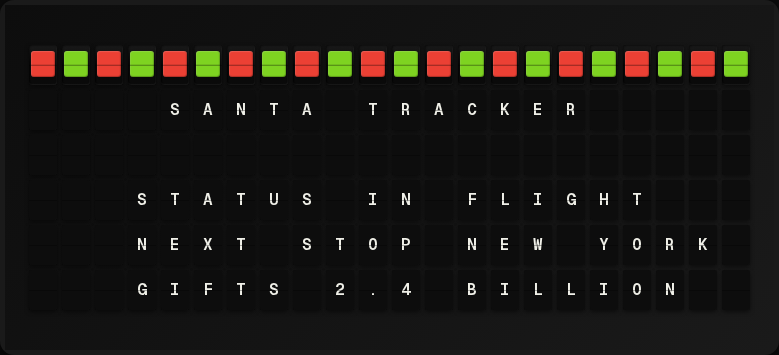

# Santa Tracker Plugin

A FiestaBoard plugin that tracks Santa's journey around the world on Christmas Eve and Christmas Day.



## How It Works

The plugin monitors when midnight of December 25th arrives at famous/remarkable world locations across every timezone. As each timezone crosses into Christmas Day, the plugin updates to show Santa's progress.

### Tracked Locations (by timezone, earliest first)

| Location | Timezone |
|----------|----------|
| Auckland, New Zealand | UTC+13 |
| Sydney, Australia | UTC+11 |
| Tokyo, Japan | UTC+9 |
| Beijing, China | UTC+8 |
| Bangkok, Thailand | UTC+7 |
| Dhaka, Bangladesh | UTC+6 |
| Delhi, India | UTC+5 |
| Dubai, UAE | UTC+4 |
| Moscow, Russia | UTC+3 |
| Athens, Greece | UTC+2 |
| Paris, France | UTC+1 |
| London, England | UTC+0 |
| Reykjavik, Iceland | UTC+0 |
| São Paulo, Brazil | UTC-3 |
| Buenos Aires, Argentina | UTC-3 |
| New York, USA | UTC-5 |
| Chicago, USA | UTC-6 |
| Denver, USA | UTC-7 |
| Los Angeles, USA | UTC-8 |
| Anchorage, USA | UTC-9 |
| Honolulu, USA | UTC-10 |

### Status Messages

- **Before Christmas**: `"Santa is getting ready for {year}"`
- **During delivery**: `"Santa is delivering presents!"`
- **After Christmas**: `"Santa is done for {year}"`

## Template Variables

### Simple Variables

| Variable | Description | Example |
|----------|-------------|---------|
| `status` | Current Santa status message | "Santa is delivering presents!" |
| `santa_location` | Where Santa currently is | "Paris, France" |
| `last_visited` | Last location Santa visited | "London, England" |
| `next_stop` | Next location Santa will visit | "New York, USA" |
| `visited_count` | Number of locations visited | "11" |
| `total_locations` | Total tracked locations | "21" |
| `progress_percent` | Delivery progress percentage | "52" |
| `year` | Christmas year being tracked | "2026" |

### Array Variables

| Variable | Description |
|----------|-------------|
| `locations[].name` | Location display name |
| `locations[].state` | "visited", "current", or "upcoming" |

## Template Examples

```
{{santa_tracker.status}}
```

```
Santa: {{santa_tracker.santa_location}}
Next: {{santa_tracker.next_stop}}
Progress: {{santa_tracker.progress_percent}}%
```

## Development

No external API is required — the plugin uses timezone calculations to determine Santa's position based on the current UTC time.

### Running Tests

```bash
python -m pytest plugins/santa_tracker/tests/ -v
```
