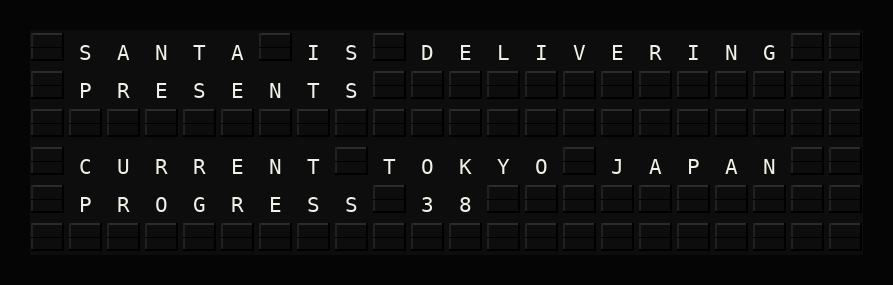
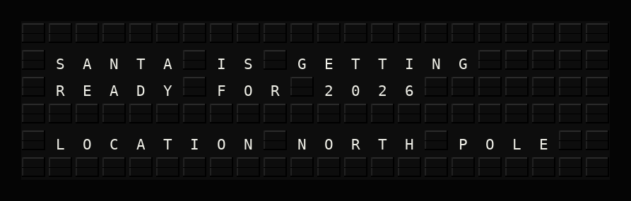
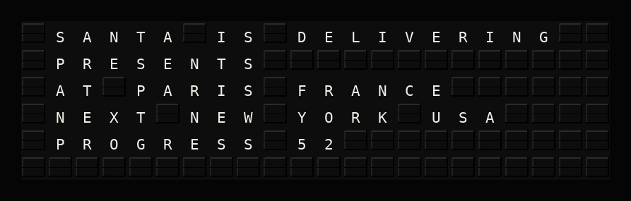
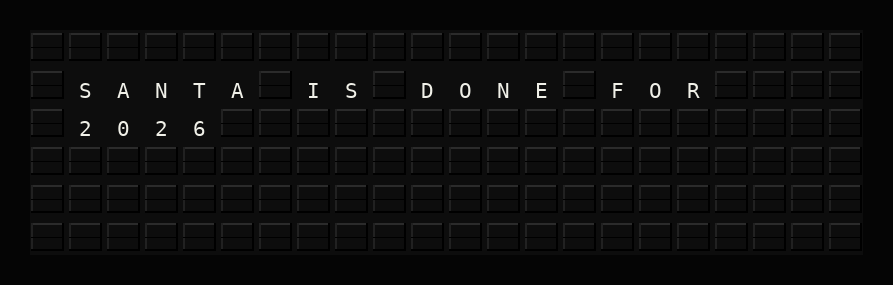

# Santa Tracker Setup Guide

## Overview

**What it does:**
- Tracks Santa's journey around the world on Christmas Eve / Christmas Day
- Shows which famous city Santa is currently visiting
- Displays progress as midnight of December 25th sweeps across timezones



**Prerequisites:**
- ✅ No API key required
- ✅ No external accounts needed
- ✅ Works out of the box

## Quick Setup

### 1. Enable the Plugin

In the FiestaBoard web UI:
1. Go to **Integrations** and find **Santa Tracker**
2. Toggle **Enabled** to on
3. Optionally set a specific year (defaults to current year)
4. Click **Save Changes**

### 2. Use in Templates

Available variables:
- `{santa_tracker.status}` — Current status message
- `{santa_tracker.santa_location}` — Where Santa is right now
- `{santa_tracker.next_stop}` — Next city on Santa's route
- `{santa_tracker.progress_percent}` — Percentage of deliveries complete

Example template:
```
{santa_tracker.status}
At: {santa_tracker.santa_location}
```

### 3. Example Display States

**Before Christmas:**



**During Delivery:**



**After Christmas:**



## Configuration Reference

| Setting | Type | Required | Description |
|---------|------|----------|-------------|
| `enabled` | boolean | No | Enable or disable the plugin (default: true) |
| `year` | integer | No | Christmas year to track (default: current year) |

## How It Works

The plugin tracks 21 famous world locations across all timezones. As midnight of December 25th arrives in each timezone, that location is marked as "visited." The plugin shows three states:

1. **Getting ready** — Before Dec 25 anywhere in the world
2. **Delivering presents** — Dec 25 has arrived in some but not all locations
3. **Done** — Dec 25 has passed in all tracked locations

## Troubleshooting

### Common Issues

**Issue: Plugin shows "Santa is getting ready"**
- This is normal if it's not yet December 25th in any timezone
- The earliest timezone (Auckland, NZ at UTC+13) will be first to flip

**Issue: Plugin shows "Santa is done"**
- This means December 25th has ended in all tracked locations
- Wait until next year, or set the `year` setting to a future year

## Support

- Plugin Repository: [FiestaBoard GitHub](https://github.com/Fiestaboard/FiestaBoard)
- Issues: [GitHub Issues](https://github.com/Fiestaboard/FiestaBoard/issues)
- Author: FiestaBoard Team
